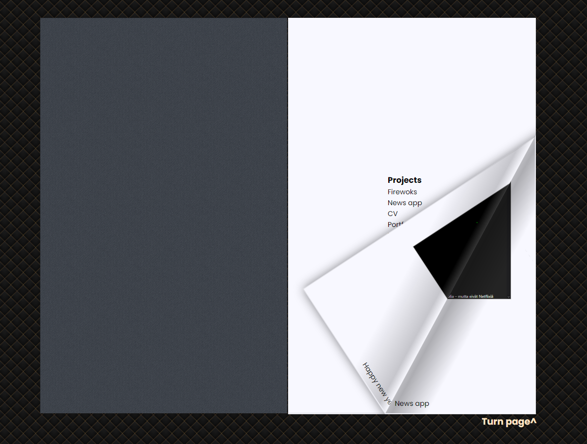

# My Projects Flipbook

An interactive digital book showcasing various of my web projects, created using the turn.js library. Hosted in [Vercel](https://flip-book-tau.vercel.app/)

<p align="center">
<br>
<strong>FlipBook sreenshot</strong>
</p>

## 📖 Overview

This project creates a virtual flipbook that displays multiple web projects in an interactive book-like interface. Users can flip through pages to see different projects embedded as iframes.

## ✨ Features

- Book-like page turning animations
- Hardcover front and back
- Embedded iframes for displaying live websites
- Responsive design with background texture

## 🛠️ Technologies Used

- HTML5
- CSS3
- JavaScript
- jQuery (dependency for turn.js)
- turn.js library for page flip effects

## 📋 Project Structure

```
flipbook/
├── index.html          # Main HTML file
├── style.css           # CSS styling
├── jquery.js           # jQuery library
├── turn.js             # Page flip library
├── denim.png           # Coverpage texture image
└── fancy-cushion.webp  # Background texture image
```

## 🚀 Installation

1. Clone this repository:
   ```bash
   git clone https://github.com/username/projects-flipbook.git
   cd projects-flipbook
   ```

2. Ensure all dependencies are in the correct location:
   - jQuery library (`jquery.js`)
   - turn.js library (`turn.js`)
   - Background texture (`fancy-cushion.webp`)

3. Open `index.html` in your browser or deploy to a web server.

## 💻 Usage

The flipbook automatically initializes when the page loads. Users can:
- Click on the right edge of the book to flip forward
- Click on the left edge to flip backward
- Drag corners to manually turn pages

## 📄 HTML Structure

The flipbook consists of multiple div elements inside a parent container with the class "flipbook":

```html
<div class="flipbook">
  <!-- Hard cover front -->
  <div class="hard">...</div>
  
  <!-- Pages with content -->
  <div>...</div>
  
  <!-- Hard cover back -->
  <div class="hard">...</div>
</div>
```

### Page Types

1. **Hard Cover**: Pages with class "hard" represent the book covers
2. **Content Pages**: Regular divs containing project iframes
3. **Table of Contents**: Lists all projects included in the book

## 📑 Featured Projects

The flipbook showcases the following projects:

1. **Fireworks** - New Year celebration page (https://2025.dudo.fi)
2. **News App** - RSS reader application (https://rss.dudo.fi)
3. **CV** - Personal resume site (https://dudo.fi)
4. **Portfolio** - Project showcase (https://risto.dudo.fi)
5. **Fortune Wheel** - Interactive spinning wheel (https://spin.dudo.fi)
6. **CLI** - Command line interface (https://start.dudo.fi)

## ⚙️ Customization

### Adding New Pages

To add new pages to the flipbook:

```html
<div class="flipbook">
  <!-- Existing pages -->
  
  <!-- New page -->
  <div>
    <iframe src="https://your-project-url.com" style="width:800px; height:800px; scale: 0.5;"></iframe>
    <small>Project Description</small>
  </div>
  
  <!-- Back cover -->
  <div class="hard">Thank You <small>~ Dudo</small></div>
</div>
```

### Styling

The appearance can be customized by modifying the CSS properties in `style.css`.

## 📚 turn.js Configuration

The flipbook is initialized with:

```javascript
$(".flipbook").turn();
```

### Additional Options

For more advanced configurations:

```javascript
$(".flipbook").turn({
  width: 800,
  height: 600,
  autoCenter: true,
  gradients: true,
  acceleration: true
});
```

## 🔗 Dependencies

- [jQuery](https://jquery.com/) - Required for turn.js
- [turn.js](http://www.turnjs.com/) - HTML5-based page flip effect

## 🔍 Browser Compatibility

This project works best in modern browsers with HTML5 support:
- Chrome (latest)
- Firefox (latest)
- Safari (latest)
- Edge (latest)

## 🤝 Contributing

Contributions are welcome! Please feel free to submit a Pull Request.

## 📜 License

This project is open source and available under the MIT License.

## 👤 Author

Created by Dudo(aka ristoxxx) - [https://dudo.fi](https://dudo.fi)
